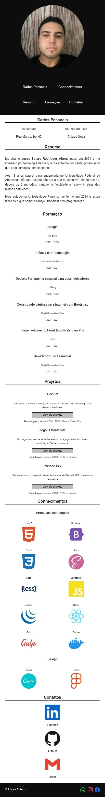
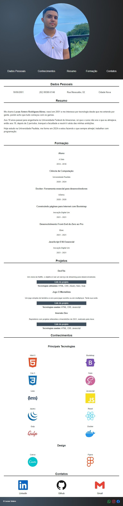
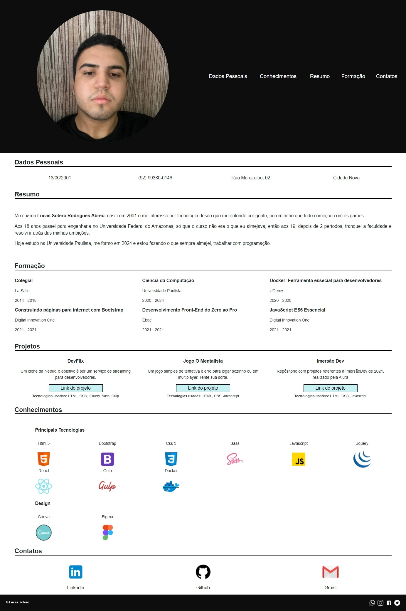

<h2>MyWebsite</h2>

<section>
  
  <h3 align="center">Versão mobile</h3>
  
  

  
</section>

<section>
  
  <h3 align="center">Versão tablet</h3>
  
  

  
</section>

<section>
  
  <h3 align="center">Versão desktop</h3>
  
  
  
  
</section>

<h2>Sobre</h2>

<h4>"Um projeto autoral, com o objetivo de ser uma forma de clientes, conhecidos e outros dev's conhecerem melhor sobre meu lado profissional. 🖖"</h4>

<h2>Motivo</h2>

Iniciei esse projeto com o intuito de praticar o que estava aprendendo enquanto estudava, porém decidi criar um website para servir como uma carta de entrada. Um site simples com o objetivo de conhecerem melhor meu lado profissional, e se gostarem, terem meios de entrar em contato comigo. 

<h2>Objetivos</h2>

<ol>
  <li>O site tem apenas a função de informar o leitor sobre meu trabalho, contendo alguns links para entrar em contato direto comigo</li>
  <li>O site pode ser aberto nas principais telas do mercado: mobile, tablet e desktop</li>
</ol>

<h2>Funcionalidades</h2>

<ul>
  <li>Clicando em qualquer item do menu (localizado acima da minha foto) você é direcionando para a seção de leitura referente.</li>
  <li>Passando o mouse ou clicando na minha foto, ela fica com mais cor.</li>
  <li>Os links na seção "Contatos" redirecionam o usuário para os respectivos aplicativos.</li>
  <li>O link com o ícone de casa, é a Home, um gancho para levar o usuário de volta para o topo do site.</li>
  <li>Os links no do rodapé (instagram e twitter) são minhas redes sociais mais usadas, caso queira me conhecer melhor.</li>
</ul>

<h2>Instalação</h2>
  
<h5>$ git clone https://github.com/lucassoteroo/WebSite.git</h5> 

<h2>Rodar o comando:</h2>
  
<h5>$ Npm install</h5> 

<h2>Contrução</h2>

